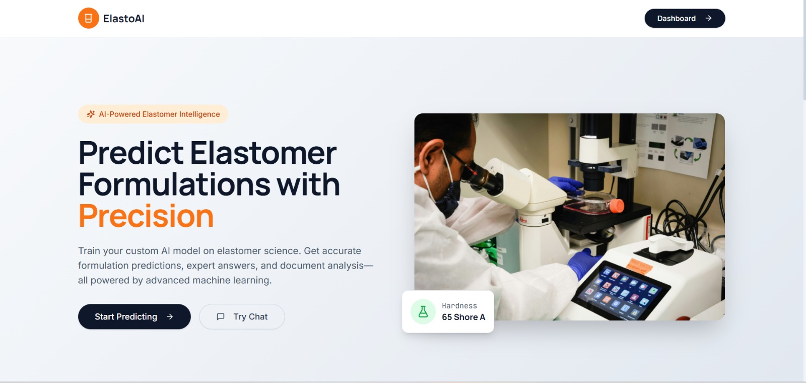
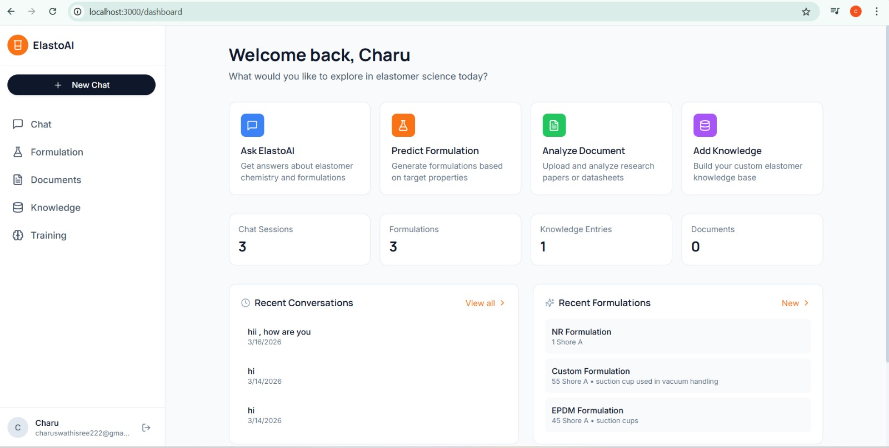
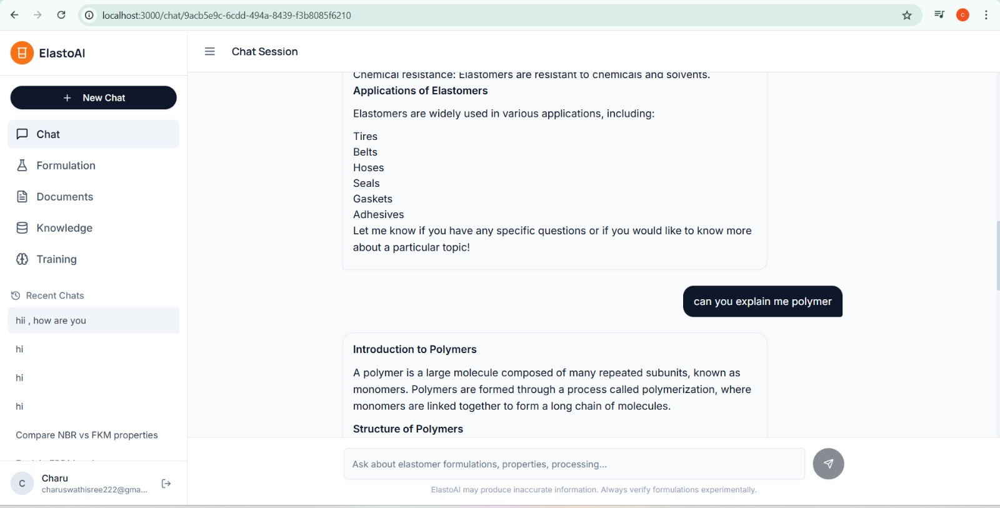
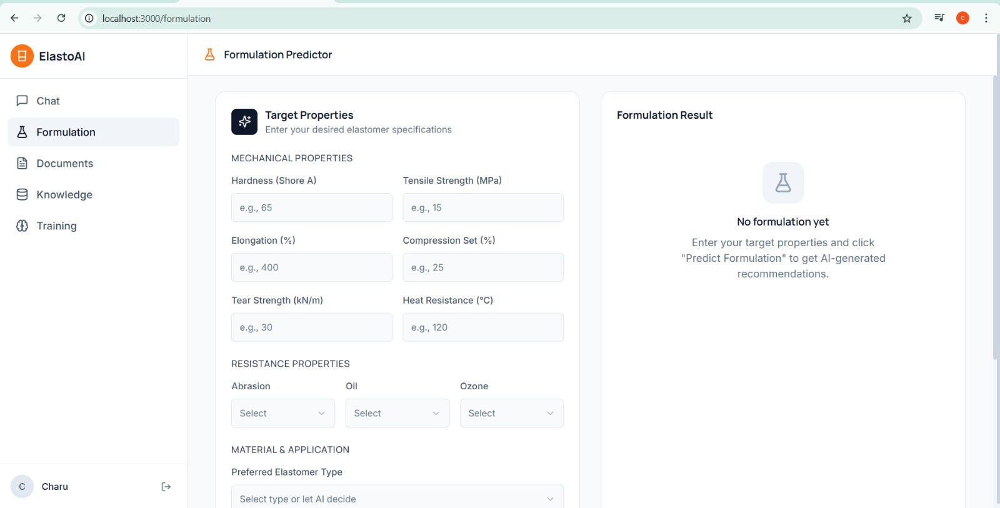
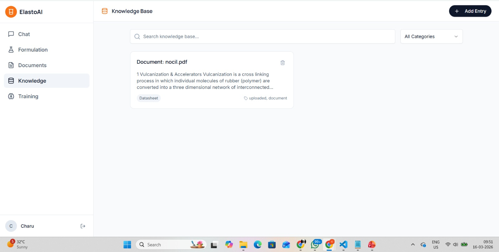
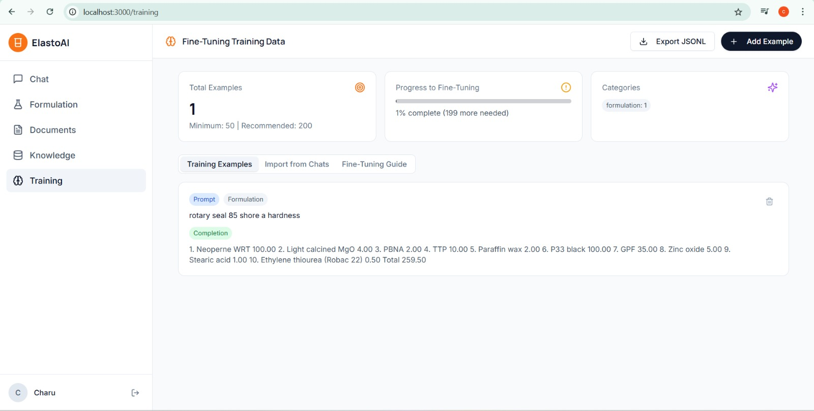

#  ElastoAI — AI for Elastomer Formulation Optimization

##  Overview
ElastoAI is an AI-powered platform designed to assist engineers and researchers in developing elastomer formulations efficiently.

It reduces costly trial-and-error experimentation by leveraging AI, document analysis, and intelligent recommendations.

---

##  Problem
Elastomer formulation development is:
- Time-consuming  
- Expensive  
- Requires multiple physical experiments  

---

##  Solution
ElastoAI provides:
- AI-based formulation prediction  
- Chat-based expert assistant  
- Document analysis for research insights  
- Knowledge base for elastomer science  

---

##  Tech Stack
- **Frontend:** React  
- **Backend:** FastAPI  
- **Database:** MongoDB  
- **AI Layer:** LLM + Sentence Transformers  
- **Other:** REST APIs, RAG System  

---

##  Features

-  AI-powered elastomer formulation prediction  
-  Chat-based elastomer assistant  
-  Document analysis (PDF support)  
-  Knowledge base system  
-  Fine-tuning training module  
-  Real-time interactive dashboard  

---

##  Architecture

- Frontend (React Dashboard)
- Backend (FastAPI Server)
- AI Layer (LLM + Embeddings)
- Database (MongoDB)

---

##  Application Screenshots

###  Home Page

---

###  Dashboard

---

###  AI Chat Interface

---

###  Formulation Predictor

---

###  Document Analysis

---

###  Knowledge Base

---

###  Training Module

---

##  Demo Video
[Watch Demo](https://youtu.be/QOP9QM4YYoc)

---

##  Impact
- Reduces R&D cost  
- Speeds up formulation development  
- Bridges AI with material science  

---

##  Author
** R Charu Swathi Sree**

---

##  Future Improvements
- Advanced ML models for prediction  
- Multi-user collaboration  
- Cloud deployment  
- Enhanced UI/UX  
